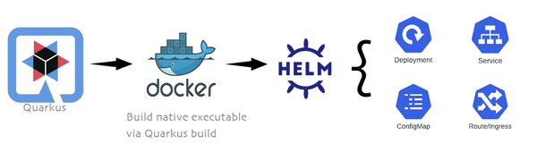

# Quarkus Project with Helm Chart

This project uses Quarkus to serve a REST service.

Then a native image is generated via
```shell script
./mvnw package -Pnative -Dquarkus.native.container-build=true
```

## Helm Chart

You can deploy this app to a Kubernetes cluster using the Helm chart in src/main/helm folder.
Ingress settings are configured to rewrite http://localhost/hellorest to direct to 8080 port of Quarkus executable.
In
```shell script
cd src/main/heml
helm package hellorest
helm install hellorest hellorest-1.16.2.tgz
```

